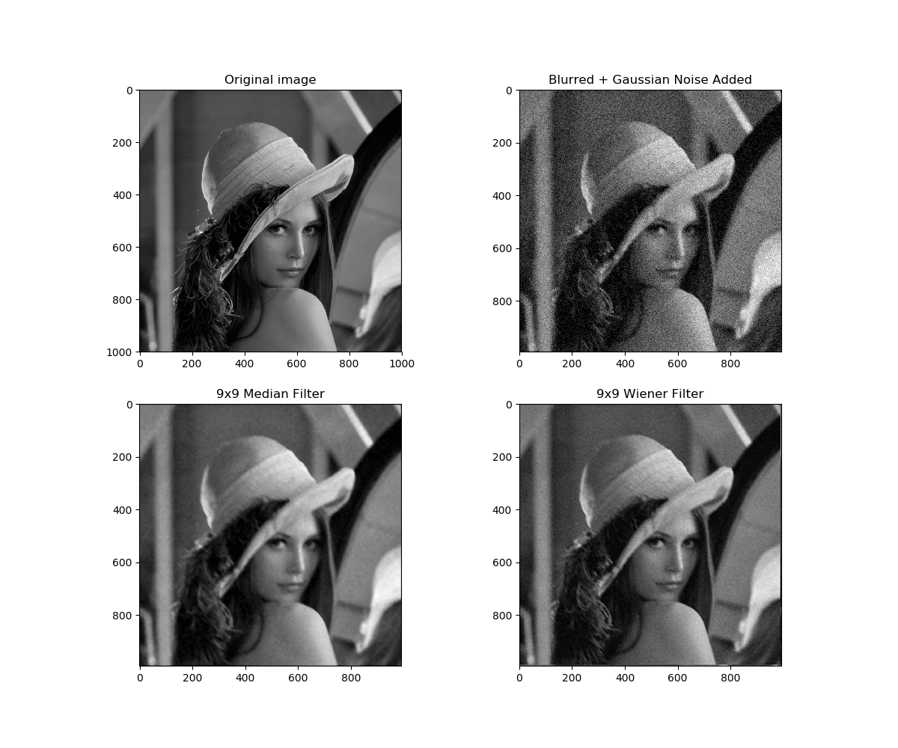
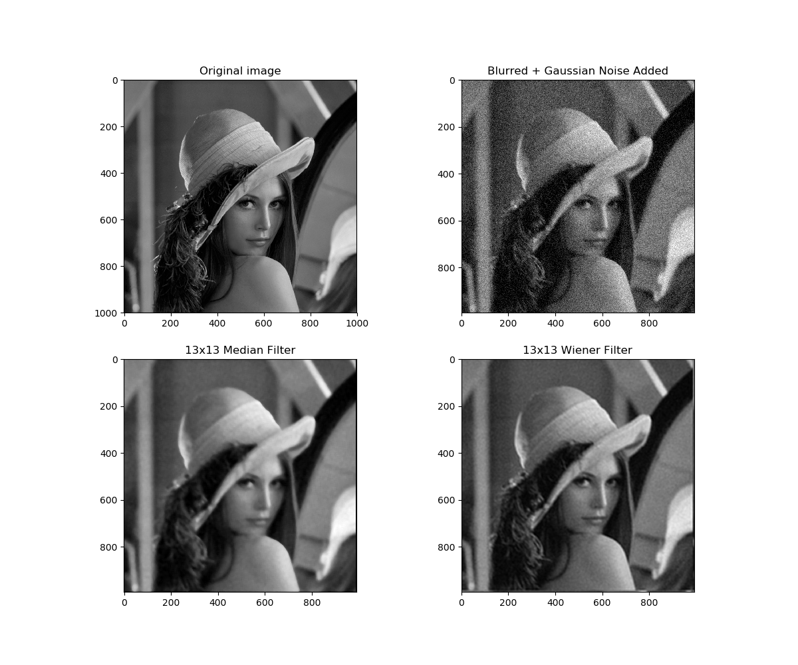

# Wiener-Median-Comparison
A comparison of Median filter and Wiener filter in image restoration. 
The image corrupted by motion blurring and adding Gaussian noise was used to test in the program. Link to project: https://www.researchgate.net/publication/332574579_Image_Processing_Course_Project_Image_Filtering_with_Wiener_Filter_and_Median_Filter
The results produced by running Compare_Filters.py:

Comparison with the kernel size of 9x9:

Comparison with the kernel size of 13x13:

Tran Le Anh, April 22, 2019.
